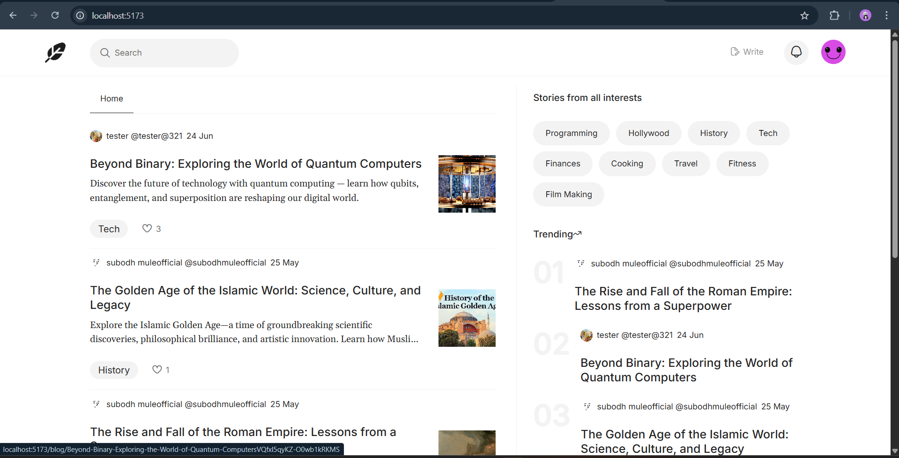
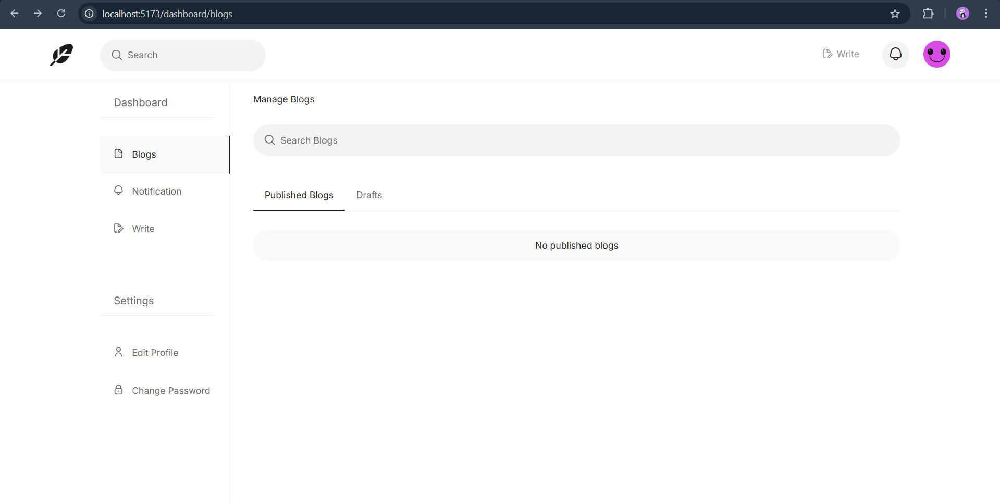
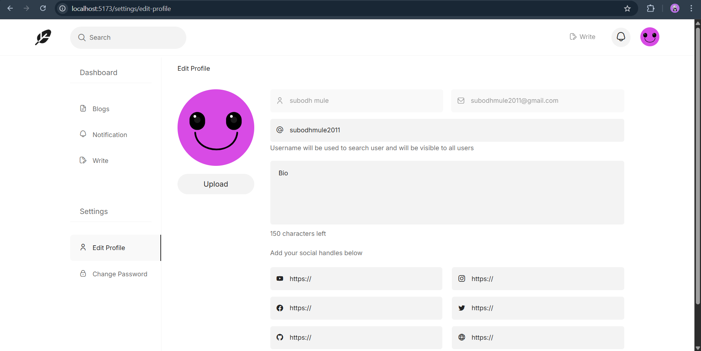

# WritersRoom – MERN Blogging Platform

## 🌐 Live Demo

👉 https://writersroom.developersubodh.in  

##  Production Deployment

This project is fully deployed on **AWS EC2** with a production-grade architecture:

- Dockerized frontend & backend services
- Nginx reverse proxy with domain routing
- HTTPS enabled via Let's Encrypt (auto-renewal)
- Firebase Google OAuth configured for production
- AWS S3 media storage with pre-signed uploads


## Platform Description

A full‑stack blogging platform inspired by **Medium.com**, built with the **MERN stack**, **Firebase Auth**, **AWS S3**, and a rich‑text editor (Editor.js). Users can write and publish blogs, manage drafts, interact via likes and comments, and keep track of activity through a personalized dashboard and notifications.

---

## Features

- **Modern home feed**
  - Latest blogs with pagination.
  - Trending section based on reads and likes.
  - Category filters (programming, tech, travel, cooking, fitness, etc.).
- **Rich blog editor**
  - Editor.js blocks (headers, lists, code, embeds, images, quotes, inline code, links, markers).
  - Save as **draft** or **publish** with banner image and tags.
- **Authentication & security**
  - Email/password signup and signin with strong validation.
  - **Google login** via Firebase.
  - JWT‑based auth for protected API routes.
- **User profiles & account management**
  - Public profile page with avatar, bio, social links, blog and reads stats.
  - Upload profile image to AWS S3.
  - Edit profile, social links, and short bio.
  - Change password (for non‑Google accounts) with strong password rules.
- **Dashboard**
  - Manage published blogs and drafts (search, paginate, delete).
  - Notifications for likes, comments, and replies with filters and paging.
  - New notification indicator on the navbar bell icon.
- **Engagement**
  - Like / unlike blogs (with notification to the author).
  - Comment and threaded replies with pagination.
  - Per‑blog and per‑user read / comment / like counters.
- **Search**
  - Search blogs by title.
  - Search users by username.

---

## Tech Stack

- **Frontend**
  - React 18, Vite
  - React Router DOM
  - Tailwind CSS
  - Editor.js (multiple tools: code, header, image, embed, list, link, marker, quote, inline‑code)
  - Axios
  - Firebase (client‑side Google auth)
  - Framer Motion (page / card animations)
  - React Hot Toast (notifications)
- **Backend**
  - Node.js, Express
  - MongoDB + Mongoose
  - JWT (jsonwebtokens) for authentication
  - Bcrypt for password hashing
  - AWS SDK (S3 pre‑signed upload URLs)
  - Firebase Admin SDK (server‑side Google auth verification)
- **Other**
  - Session storage for client auth persistence
  - Nodemon for local development

---

## Screenshots

- **Home page**

  

- **Dashboard (Manage Blogs & Notifications)**

  

- **Account management (Profile & Settings)**

  

---

## Project Structure

```txt
.
├─ Readme.md
├─ server/                     # Node/Express API + MongoDB
│  ├─ server.js               # Main server, routes, JWT, S3, Firebase Admin
│  ├─ Schema/                 # Mongoose models: User, Blog, Comment, Notification, ...
│  ├─ package.json
│  └─ .env (not committed)
└─ blogging website - frontend/  # React + Vite frontend
   ├─ src/
   │  ├─ main.jsx             # App bootstrap, React Router
   │  ├─ App.jsx              # Routes and UserContext
   │  ├─ pages/
   │  │  ├─ home.page.jsx
   │  │  ├─ editor.pages.jsx
   │  │  ├─ blog.page.jsx
   │  │  ├─ profile.page.jsx
   │  │  ├─ manage-blogs.page.jsx
   │  │  ├─ notifications.page.jsx
   │  │  ├─ edit-profile.page.jsx
   │  │  ├─ change-password.page.jsx
   │  │  ├─ search.page.jsx
   │  │  ├─ userAuthForm.page.jsx
   │  │  └─ 404.page.jsx
   │  ├─ components/          # Navbar, side nav, blog cards, editor, comments, etc.
   │  └─ common/              # session, firebase, aws, pagination helpers, animations
   ├─ package.json
   └─ .env (not committed)
```

---

## Getting Started

### Prerequisites

- Node.js (LTS recommended)
- npm or yarn
- A MongoDB instance (Atlas or local)
- An AWS S3 bucket
- A Firebase project (for Google authentication)

---

### 1. Clone the repository

```bash
git clone https://github.com/SSM2011/blogging-platform-fullstack.git
cd "MERN BLOGGING WEBSITE - Copy/mern-blogging-website"
```

---

### 2. Backend setup (`server/`)

```bash
cd server
npm install
```

Create a `.env` file in `server/`:

```bash
PORT=3000
DB_LOCATION=mongodb+srv://<user>:<password>@<cluster>/<db-name>
SECRET_ACCESS_KEY=<random-long-secret-for-JWT>
AWS_ACCESS_KEY=<your-aws-access-key-id>
AWS_SECRET_ACCESS_KEY=<your-aws-secret-access-key>
AWS_REGION=<your-aws-region>              # e.g. eu-north-1
AWS_BUCKET_NAME=<your-s3-bucket-name>     # e.g. blogging-platform-fullstack
```

Firebase Admin:

- Place your Firebase service account JSON in `server/` and update the path in `server.js` if you rename it:
  - Currently referenced as `./react-js-blogging-websit-71a5d-firebase-adminsdk-fbsvc-7a76d5477a.json`.

Run the backend:

```bash
npm start
```

The API will run on **http://localhost:$PORT** (for example `http://localhost:3000`).

---

### 3. Frontend setup (`blogging website - frontend/`)

In a new terminal:

```bash
cd "blogging website - frontend"
npm install
```

Create a `.env` file in `blogging website - frontend/`:

```bash
VITE_SERVER_DOMAIN=http://localhost:3000
```

Run the frontend:

```bash
npm run dev
```

By default Vite runs on **http://localhost:5173**.

---

## Key Screens & Flows

- **Home page (`/`)**
  - Shows latest blogs with pagination and a “Load more” button.
  - Right sidebar with category filters and a trending list.
- **Blog editor (`/editor`, `/editor/:blog_id`)**
  - Create or edit blogs using Editor.js.
  - Save as draft or publish with banner, description, and tags.
- **Dashboard (`/dashboard/blogs`, `/dashboard/notifications`)**
  - Manage Blogs: filter/search, paginate, and delete published/draft posts.
  - Notifications: view likes, comments, replies with filters and “Load more”.
- **Account management (`/settings/edit-profile`, `/settings/change-password`)**
  - Edit profile: avatar upload to S3, username, bio, and social links (with validation).
  - Change password: for email/password accounts with strict password policy.
- **Authentication (`/signin`, `/signup`)**
  - Email/password auth with validation.
  - Google sign‑in via Firebase; server verifies using Firebase Admin and issues JWT.

---

## API Overview (High Level)

Backend routes (selected):

- **Auth**
  - `POST /signup` – create account with email/password.
  - `POST /signin` – login with email/password.
  - `POST /google-auth` – login/signup via Google (Firebase).
  - `POST /change-password` – change password (JWT protected).
- **User & profile**
  - `POST /get-profile` – fetch public profile by username.
  - `POST /update-profile-img` – update avatar (JWT, S3 image URL).
  - `POST /update-profile` – update username, bio, social links (JWT).
- **Blogs**
  - `POST /create-blog` – create/update blog (draft or published).
  - `POST /get-blog` – fetch single blog (increments reads).
  - `POST /latest-blogs`, `POST /all-latest-blogs-count`
  - `POST /search-blogs`, `POST /search-blogs-count`
  - `POST /user-written-blogs`, `POST /user-written-blogs-count`
  - `POST /delete-blog` – delete blog, its comments, and notifications.
- **Engagement**
  - `POST /like-blog`, `POST /isliked-by-user`
  - `POST /add-comment`, `POST /get-blog-comments`, `POST /get-replies`, `POST /delete-comment`
- **Notifications**
  - `GET /new-notification` – whether unseen notifications exist.
  - `POST /notifications`, `POST /all-notifications-count`
- **Media**
  - `GET /get-upload-url` – S3 pre‑signed URL for image upload.

All protected routes expect a header:

```http
Authorization: Bearer <JWT_ACCESS_TOKEN>
```

---

## Security

- **JWT‑based authentication**
  - Server issues a signed JWT (`access_token`) on successful login/signup.
  - JWT is sent from the frontend in the `Authorization: Bearer <token>` header for every protected request.
- **Password hashing**
  - User passwords are never stored in plain text.
  - Passwords are hashed using **bcrypt** before being saved in MongoDB.
- **Protected routes**
  - Backend uses a `verifyJWT` middleware to protect sensitive routes (create/update/delete blog, notifications, comments, profile updates, change password, etc.).
  - Requests without a valid token receive `401 / 403` responses.
- **Pre‑signed S3 uploads**
  - Images are not uploaded directly through the API server.
  - Backend exposes `GET /get-upload-url`, which returns a **time‑limited, single‑use pre‑signed S3 URL** scoped to a specific object key.
  - Frontend uploads images directly to S3 using that URL; only the final public URL is stored in MongoDB.
- **Firebase only for Google login**
  - Firebase client SDK is used on the frontend **only** to perform Google OAuth.
  - Firebase Admin SDK on the backend verifies the Google ID token and then issues the app’s own JWT.
- **JWT as session**
  - The JWT acts as the session token; the frontend keeps it in `sessionStorage` and attaches it to API calls.
- **MongoDB for data storage**
  - All app data (users, blogs, comments, notifications) is stored in MongoDB via Mongoose models.
  - Sensitive fields like password hashes and internal IDs are never exposed in public profile responses.

---

## Notes

- This project is intended as a **Medium‑style clone for learning and portfolio purposes**.
- Before deploying to production, review:
  - Secret management and `.env` handling.
  - Error handling and logging.
  - S3 bucket permissions and Firebase credentials.
 
### Contributing

1. Fork the repository or create a feature branch.
2. Install dependencies and configure `.env`.
3. Open a pull request with a clear description of your changes.


### License

This project is licensed under the MIT License — see the LICENSE file for details.
